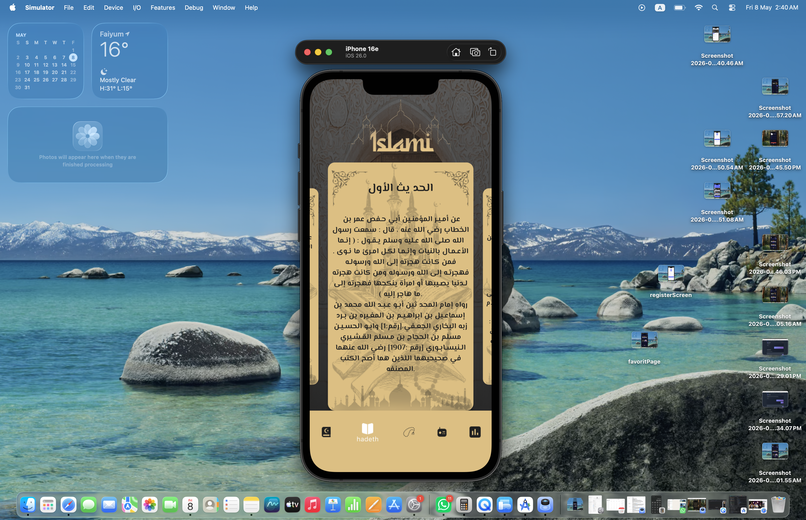
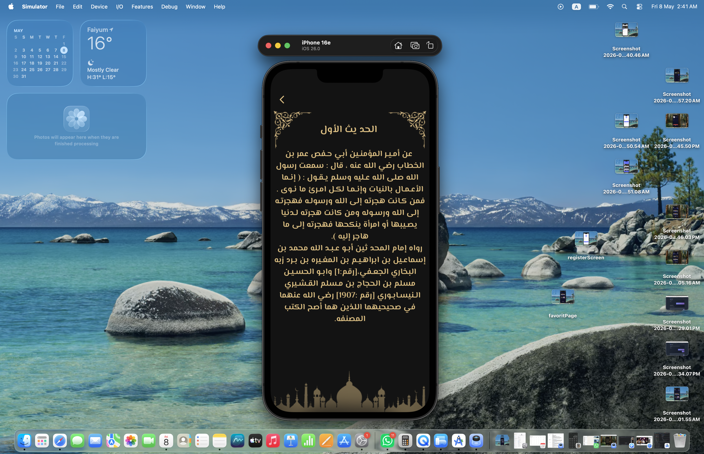

# 🕌 Islami App

Flutter-based Islamic application that provides Quran browsing, Hadith, Sebha counter, prayer times, and Islamic radio streaming in a simple and responsive UI.

---

## 🧑‍💻 Developer

**Youssef Ezzat Abdel Alim**  
Flutter Developer  
📍 Cairo, Egypt  
📧 youssefezzat937@gmail.com  
📞 +20 100 494 8756  
🔗 https://github.com/YoussefEzzat1012/islami | https://www.linkedin.com/in/youssef-ezzat-0775462b9/?skipRedirect=true  

---

## 📱 Features

- 📖 Quran browsing with Surahs and verses  
- 📚 Hadith collection display  
- 📿 Sebha (Tasbeeh) counter  
- 🕌 Prayer times display  
- 📻 Islamic radio streaming  
- 🌐 Arabic / English localization  
- 🎨 Responsive and clean UI  

---

## 🛠️ Tech Stack

Flutter • Dart • Provider • REST APIs • Localization • Local JSON

---

## 🧱 Architecture

- Clean separation of UI and logic  
- Provider for state management  
- Reusable components  
- Scalable folder structure  

---

## Screenshots

### Home Screen

### quran Screen

### Hadeeth Screen

### Hadeeth Details Screen

## 📂 Project Structure

lib/
├── models/
├── providers/
├── screens/
├── widgets/
├── services/
├── utils/
├── l10n/
└── main.dart

---

## 🚀 Getting Started

git clone https://github.com/your-username/islami-app.git  
cd islami-app  
flutter pub get  
flutter run  

---

## 🎯 Key Learnings

- REST API integration  
- State management with Provider  
- Responsive UI design  
- Localization (Arabic / English)  
- Clean architecture principles  

---

## 📄 License

This project is for educational and portfolio purposes.
